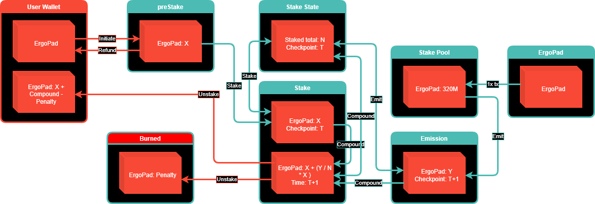
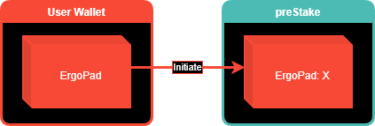
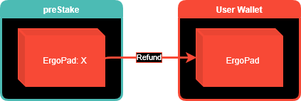
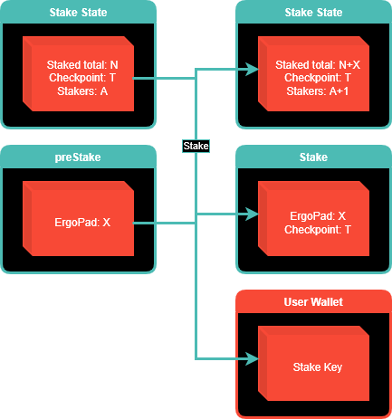
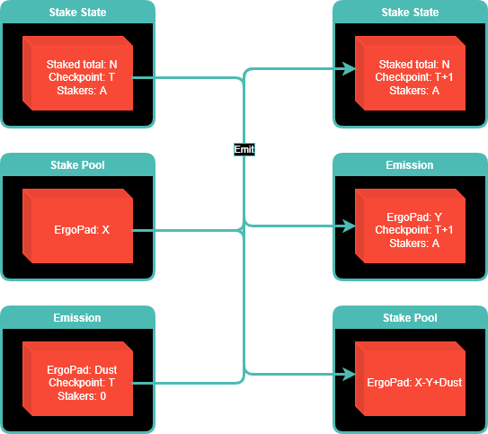
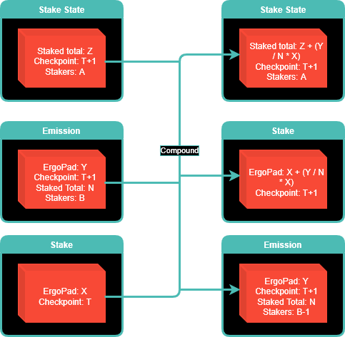
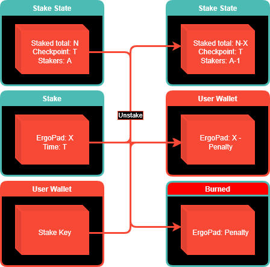

# ErgoPad Staking Setup

Tokens can be staked on ErgoPad. The benefits of staking for the staker is described [here](https://github.com/ergo-pad/ergopad/tree/staking-contracts/docs#staking)
The goal of the staking contracts is long term security of the stakers and the locked tokens waiting for emission.
Because the staking runs over a long period of time it is important to keep the contracts as secure as possible and make it possible for anyone to interact with them and not hard code any wallets.

# Components

Brief overview of the components of the system:

| Type | Name | Description |
| --- | --- | --- |
| NFT | Stake State NFT | NFT to identify the Stake State box |
| NFT | Stake Pool NFT | NFT to identify the Stake Pool box |
| NFT | Emission NFT | NFT to identify the Emission box |
| NFT | Stake Key NFT | NFT to be used as a key to unstake funds, uniquely generated for each Stake box |
| Token | Stake Token | Token to prove the Stake box is generated in the correct way and is qualified for receiving funds in the Compound transaction |
| Contract | preStake | Proxy for staking setup |
| Contract | Stake State | Script ensuring correctness of the Stake State box |
| Contract | Stake | Script to guard staked funds |
| Contract | Stake Pool | Box to hold the funds that are to be distributed through staking |
| Contract | Emission | Box to hold funds to be distributed during a staking cycle and keep track of progress |

# Contracts/Box Types

There are multiple contracts in play in the staking setup, each playing their role to ensure proper execution of the different transactions.

## preStake

The preStake contract is a proxy for the staking setup to ensure the correct amount of assets are present and the actual stake transaction can be executed correctly. If for some reason conditions for staking are not met a refund can be issued to the user so they can try again.

### Registers

| Register | Type | Description |
| --- | --- | --- |
| 4 | Coll\[Byte\] | Ergotree of user wallet |

### Assets

| Index | Asset | Amount |
| --- | --- | --- |
| 0 | ErgoPad | >0 |

## Stake Pool

The Stake Pool contract locks the tokens to be distributed during the staking period and only allows the correct amount of tokens to be released for each staking cycle.

### Registers

| Register | Type | Description |
| --- | --- | --- |
| 4 | Long | Emission amount |

### Assets

| Index | Asset | Amount |
| --- | --- | --- |
| 0 | Stake Pool NFT | 1 |
| 1 | ErgoPad | <=320M |

## Stake State

The stake state box keeps track of the state of the system and is identified with the "Staking State NFT". This box keeps track of important parameters of the staking algorithm such as total amount staked and therefor needs to be a part of all transactions related to the staking system. The next emission cycle is initiated by increasing the checkpoint and adding a cycle length to the last checkpoint timestamp.

### Registers

| Register | Type | Description |
| --- | --- | --- |
| 4 | Long | Total amount staked |
| 5 | Long | Checkpoint |
| 6 | Long | Stakers |
| 7 | Long | Last checkpoint timestamp |
| 8 | Long | Cycle duration |

### Assets

| Index | Asset | Amount |
| --- | --- | --- |
| 0 | Stake State NFT | 1 |
| 1 | Stake Token | <=1000M |

## Stake

The contract guarding the boxes holding the users ErgoPad tokens. Keeps track of which cycle it belongs to with the checkpoint and which token id can be used to unstake.

### Registers

| Register | Type | Description |
| --- | --- | --- |
| 4 | Long | Checkpoint |
| 5 | Coll\[Byte\] | Stake Key ID |

### Assets

| Index | Asset | Amount |
| --- | --- | --- |
| 0 | Stake Token | 1 |
| 1 | ErgoPad | >0 |

## Emission

Box holding tokens for one staking cycle. Ensures all stake boxes that belong to this cycle/checkpoint receive funds before a new cycle is started.

### Registers

| Register | Type | Description |
| --- | --- | --- |
| 4 | Long | Total amount staked |
| 5 | Long | Checkpoint |
| 6 | Long | Stakers |

### Assets

| Index | Asset | Amount |
| --- | --- | --- |
| 0 | Emission NFT | 1 |
| 1 | ErgoPad | <= Emission amount |

# Transactions

## Initiate

Funds are sent from the users wallet to the preStake box to ensure all is in order before the tokens are staked.

## Refund

If there is anything wrong the funds can be refunded to the users wallet from the preStake box

## Stake

From the preStake box a Stake box is created using the checkpoint stored in the State Stake box. The State Stake box is updated with the new total amount staked and the amount of stake boxes. A stake key NFT is generated and sent to the users wallet. This key is used to unstake the funds later on.

## Emit

The emit transaction starts the next staking cycle increasing the checkpoint on the Stake State Box and generating a new Emission box. The Emission box stores a snapshot of the amount of Stake boxes. Note that a new staking cycle can only start once the amount of stakers remaining in the Emission box is 0. This ensures all Stake boxes go through a Compound transaction before a new cycle is started.

## Compound

Now to the fun part, compounding the amount of staked tokens! Each Stake box will go through a Compound transaction exactly once each cycle. The Emission box is used to distribute tokens based on the total amount staked and the amount staked in the Stake box, the checkpoint in the Stake box is increased to make sure it is not part of the same staking cycle more than once. The Stake State box is updated with the new total staked amount and the Emission box is updated, lowering the amount of Stake boxes remaining.

## Unstake

Unstaking is done by using the Stake Key NFT. If unstaked prematurely the penalty will be burned and the remaining tokens sent to the user. The Stake State box is updated with the new total amount staked and the amount of stakers is reduced with 1.

