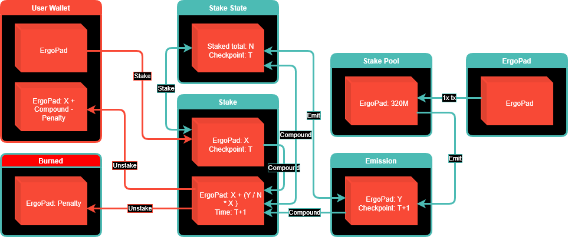

# ErgoPad Staking Setup

Tokens can be staked on ErgoPad. The benefits of staking for the staker is described [here](https://github.com/ergo-pad/ergopad/tree/staking-contracts/docs#staking)
The goal of the staking contracts is long term security of the stakers and the locked tokens waiting for emission.
Because the staking runs over a long period of time it is important to keep the contracts as secure as possible and make it possible for anyone to interact with them and not hard code any wallets.

## Contracts/Box Types

There are multiple contracts in play in the staking setup, each playing their role to ensure proper execution of the different transactions.

### Staking1

The Staking1 contract is a proxy for the staking setup to ensure the correct amount of assets are present and the actual stake transaction can be executed correctly. If for some reason conditions for staking are not met a refund can be issued to the user so they can try again.

### Stake Pool

The Stake Pool contract locks the tokens to be distributed during the staking period and only allows the correct amount of tokens to be released for each staking cycle.

The following registers are used in this contract:

| Register | Type | Description |
| --- | --- | --- |
| 4 | Long | Initial pool amount |

### Staking State

The staking state box keeps track of the state of the system and is identified with the "Staking State NFT". This box keeps track of important parameters of the staking algorithm such as total amount staked and therefor needs to be a part of all transactions related to the staking system. The next emission cycle is initiated by increasing the checkpoint and adding a cycle length to the last checkpoint timestamp.

The following registers are used:

| Register | Type | Description |
| --- | --- | --- |
| 4 | Long | Total amount staked |
| 5 | Long | Checkpoint |
| 6 | Long | Last checkpoint timestamp |

### Staking2

The contract guarding the boxes holding the tokens 